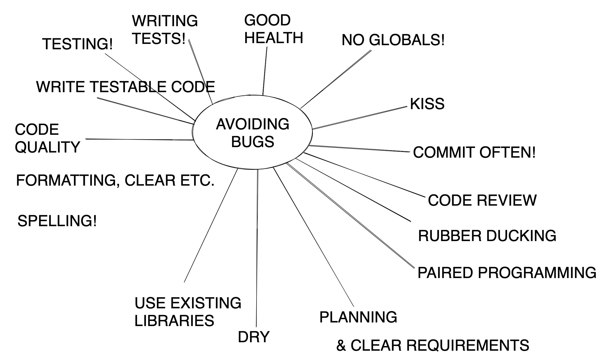
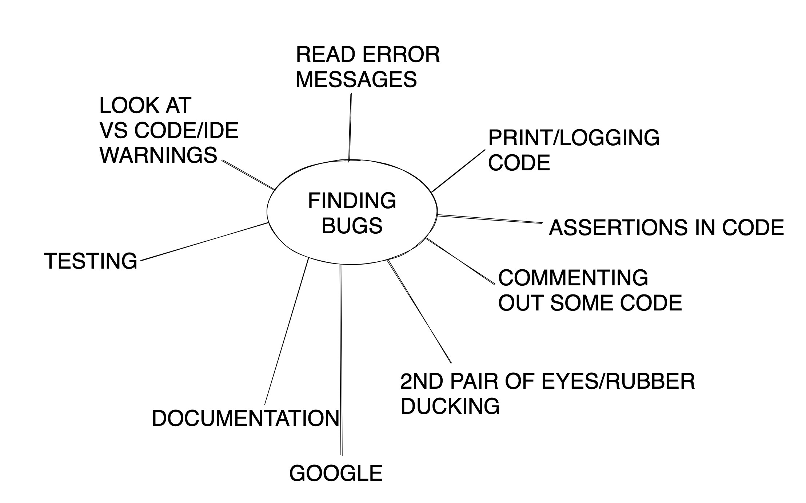

# Debugging

### Learning Objectives
- Understand the importance of debugging
- Understand how to isolate a problem through debugging
- Know best practice of debugging

## What is debugging
First, ask the students...

Debugging can both mean trying to track down and fix a bug but in practice we often also use debugging as a means to understand the flow of our code and how things are being executed.

## Why Debugging Is So Important

An inescapable part of coding is that while you're trying to make something work, you come across many bugs or errors along the way. This is entirely normal - if we could write perfect code off the top of our heads we'd all be billionaires! Unfortunately we can't, so coding becomes a process of solving one problem after another.

We're firstly going to look at a few strategies to prevent bugs, or at least reduce their occurrenc, and then later we'll have a look at how we might identify and solve the errors when they occur.

## Preventative

### Planning

It might seem obvious but as developers we often get excited to dive straight into coding without fully understanding what it is we're going to code or how we want the code to behave. Good planning before any coding takes place will almost certainly avoid some bugs!

This can include a variety of things such as using pseudocode, drawing data flow diagrams or formally gathering requirements, but we'll talk more about plannng over the coming weeks.

### Think like a user not a developer

As a developer, it's very easy to get carried away thinking of the nitty-gritty implementation we're going to use to solve a problem. However, in doing so we often lose sight of who is actually going to use our program - the user. It's good practice to always try and keep in mind 'how is this going to affect the user' so we don't introduce features or functionality that are fundamentally wrong in terms of what the user expects or wants.

### Don't rush

This may seem obvious but writing code in a rush is going to be more likely to introduce bugs. Within reason, try not to do this!

### Don't overuse comments

Writing comments in your code can be a good way of instructing developers as to what's happening in your code, or why something looks the way it does however if you find yourself writing a lot of comments, this can indicate your code might be overly complicated and needs to be refactored in some way. Comments shouldn't be overused to make up for unclear/inconcise code.

### Paired programming

Paired programming normally invovles sitting with another developer, one developer being in the 'driving seat' writing code and the other being more of an observing navigator - constantly reviewing the code, making suggestions and helping steer things in a particular direction.

This collaborative approach to development is a proven way of improving code quality and reducing bugs.

### Use code reviews

We'll give this a go later in the course, but code reviews involve asking other developers to read through your code in order to spot any mistakes, potential bugs, formatting errors etc. It may involve them running the code or just reading through it. A second or more pair of eyes is always going to help spot problems! As an aside, code reviews also generally help us to write superior code since other developers might be able to make good suggestions as to how we might improve our code.

### Don't reinvent the wheel

Where appropriate, if there is an existing library which does a job well, you should consider using this rather than writing one from scratch - which would add more complexity (and therefore likely bugs) to your project. Sometimes we need to do something more customised, so it won't always be appropriate.

For example, if you wanted your program to be able to read from an Excel file, there are many libraries available which do this for us.

### Coding standards & code quality

Adopting a coding standard (which most organisations will have) helps to keep code uniform across multiple developers, which can help reduce bugs and improve team performance and code quality.
Some of the common things you might find in a coding standard are described below.

#### Indentation and layout

Using consistent indentation and layout helps others who look at our code, as well as us who wrote the code read and understand it. It will also be much easier to spot when something is out of place.

Tip - ```cmd + A``` and then ```cmd + alt + L ```can be a quick fix. ```cmd + [ or ]``` indents highlighted text or current line left or right.

Remember that whilst some languages like Java and JavaScript are less fussy about indentation and layout, Python cares about indentation to denote blocks of code.

#### Good naming

Use explicit or clear naming for variables, functions and classes will express to you and other developers what that thing is for.

For example, what do num1, num2 and num3 mean in the following?:

wrong:
```python
def calculate(num1, num2, num3):
    # do calculation

```

Using clear naming, there can be no ambiguity about what the 3 parameters are for:

right:
```python
def calculate(length, width, height):
    # do calculation
```

### Testing
We should regularly test our code using a variety of testing types to ensure that the code works as expected and that when we've introduced new code we've not broken any existing code.

#### Unit testing
You saw this in yesterday's lesson and lab where you used tests to call functions you'd written and use assertions to verify that the functions worked as expected.

A major benefit of writing unit tests is that they can be executed repeatedly at any point in time and don't rely on any human action (where mistakes could happen!).

For example:

```python
# functions.py
def add(num1, num2):
    return num1 + num2
```

```python
# function_tests.py
def test_can_add_numbers(self):
    result = add(1,2)
    self.assertEqual(3, result)
```

#### Manual testing

This could include things like running a line of code in the Python console, or using a `print` statement to output values in the terminal to check the value of data. It can be useful for a quick check. Ideally we should not use this too often - developers have a habit of accidentally leaving print statements in their code and forgetting to remove them!

```python
def manipulate(num):
    num += 10
    print(num)
    num /= 2
    print(num)

```

### Write testable code

This is much easier when adopting a Test Driven Development (TDD) approach - something we'll look at later in the course, but always keeping in mind 'how am I going to test this code' when you're writing it is a great practice. Often developers write code first and then struggle to test it - this can be for a variety of reasons, such as too tight a coupling with other functions or resources.

### Small methods and modules with a single responsibility

Writing code in small chunks and having each function only be responsible for one thing means that it's easier to see where things are going wrong. It has other benefits too like meaning we can reuse it more. We should split up and organise our code such that each function is only tasked with one responsibility and each module comprises only related functions/functionality. This also has the benefit of making it easier to test our code.

### KISS - Keep It Simple, Silly

It's important not to overcomplicate the way we write our code - for one thing this will make it harder for other developers (as well as yourself at a later date) to read and understand what the code is doing but it's much more likely that bugs will occur in complex code, as well as being harder to track down and fix those bugs.



## Error messages

It's really important to actually read the error messages that we get. They're there to help us fix the problems after all. Don't just see that there is an error message, blank it out and go straight back to the code.

Some steps to take:

- Look at the file and line number(s)
- Look at the message - what type of error is it?
- If there is one, look at the arrow or variable name to see exactly where you should check for errors - often it's before where the arrow is pointing to.
- Go back to the code and see what you can spot.
- Some common ones:

```bash

NameError: name 'variable' is not defined

TypeError: func() takes 1 positional argument but 2 were given

IndentationError: expected an indented block
```

Examples:

#### Undefined method

```python
def defined_method():
    print("Success")


definedmethod()
```

#### Wrong number of arguments:

```python
def add(num1, num2, num3):
    return num1 + num2 + num3


add(2, 4)
```

#### Indentation Error

```python

fruits = ["apple", "orange", "pear", "plums"]

def missing(list_of_fruits):
    for fruit in list_of_fruits:
        if(fruit == "grape"):
        print("Plums!!")
        if(fruit == "apple" or fruit == "orange" or fruit == "pear"):
            print("Meh")

missing(fruits)
```

#### Stack trace

Some errors might be harder to decipher as you need to follow what's known as a stack trace - you can think of this as a step by step record of each call the interpreter made in your code, leading up until the point of failure.

```python
# test.py

def reverse_string(string):
    return ''.join(reversed(0))

def process_user_input(input):
    reversed_input = reverse_string(input)
    print(f'Your string reversed: {reversed_input}')

def get_user_input():
    user_input = input("Please enter a string to reverse: ")
    process_user_input(user_input)

get_user_input()
```

If we run this code, enter a value and press enter, we'll see the following error:

```bash
Traceback (most recent call last):
  File "/test.py", line 12, in <module>
    get_user_input()
  File "/test.py", line 10, in get_user_input
    process_user_input(user_input)
  File "/test.py", line 5, in process_user_input
    reversed_input = reverse_string(input)
  File "/test.py", line 2, in reverse_string
    return ''.join(reversed(0))
TypeError: 'int' object is not reversible
```

Being able to decipher this sort of error will take a bit of practice, but we might need to use the name of the file name, function name and line numbers to figure out where the problem lies. In this case the last line `File "/test.py", line 2, in reverse_string ... return ''.join(reversed(0))` gives us a clue to the problem - we've accidentally put a `0` in the reversed function instead of passing the string to be reversed.

The stack trace here showed the following series of calls:
1. get_user_input() was called on line 12
2. process_user_input() was called on line 10
3. reverse_string() was called on line 5
4. reversed(0) was called on line 2

## Spotting the Bug!

This will become easier with time but there are some things you can make sure to look out for. Look for spelling errors, where your brackets or opener are opening and closing, look for missing commas and colons, check capitalisation.

### Console outputting

One method of debugging is to temporarily place console output (everyone's favourite... `print`!) lines in at key points in the code to see what the value of certain variables is at certain times, or to see if a section of code is being executed. Try to make these outputs meaningful so you know exactly what's going on - e.g. 'in the name checking loop' or 'value of account after deposit is: 5' are better messages than 'hello' or '5'. Be sure to remove these once you're finished debugging. Code becomes much more difficult to read when it's cluttered with redundant `print` statements.

### Follow the flow of information

Part of a programmer's skill is in visualising the code as not just lines on a screen but as a set of objects that interact with each other. If you can learn to follow where data is being passed around and what state it should be in at any time it's easier to spot errors. Start at the beginning and follow what's happening.

### Be methodical - process of elimination

It's usually worth checking every small thing is as it should be, even if it seems obvious - like is the file saved, am I in the right directory, have I called the right function. Eliminate every possible point of failure methodically - usually the error message will point you in the right direction, but not always! You will build up a list of things to check in your head (worth writing this down too!) as you go through the course.

### Googling

https://medium.com/@niamhpower/how-to-google-effectively-as-a-developer-4ebe363afe

Top things for googling - include the language, start by being specific, make sure the problem the resulting page is solving is similar enough to yours to be useful. Googling the whole error message can get good results.

### Rubber ducking

This can be done in your head, or to a friend/instructor - talking through your code or what the problem is can often help you solve it much faster. Often when you talk through your code you'll realise that it's not actually expressing what you really want and you'll figure out what's not quite right.

http://www.rubberduckdebugging.com/

## Documentation

Make sure to find out what the recommended documentation is for the language or tool you are using, as well as looking at other options. Familiarise yourself with how that documentation is laid out, what the most useful parts of it are, and bookmark any pages you keep coming back to.

## Integrated Development Environments (IDEs)

Using an IDEs such as IntelliJ or a more lightweight code editor like Visual Studio Code will often show visual warnings (such as red squiggly lines) before you even execute your code to highlight potential probelsm. Try not to avoid these warnings as they could be something actually problematic!

In addition they provide a useful way of running your code called debuggin - we'll look at that later!



## Finally:

If you're stuck for a while, ask a classmate or an instructor - we're all here to help each other, and your instructors are paid to help you learn so use this resource while you can!

Don't get upset by bugs, even if they're 'silly' ones - this is how we learn. Programming is mainly just a series of fixing one bug after another until everything is working how we want it to. Even moving from one bug to a different one is an accomplishment - one step closer to working code! And remember, each time you solve a bug, the more likely it is you will remember and not make that mistake again, or be able to solve it loads faster the next time.
